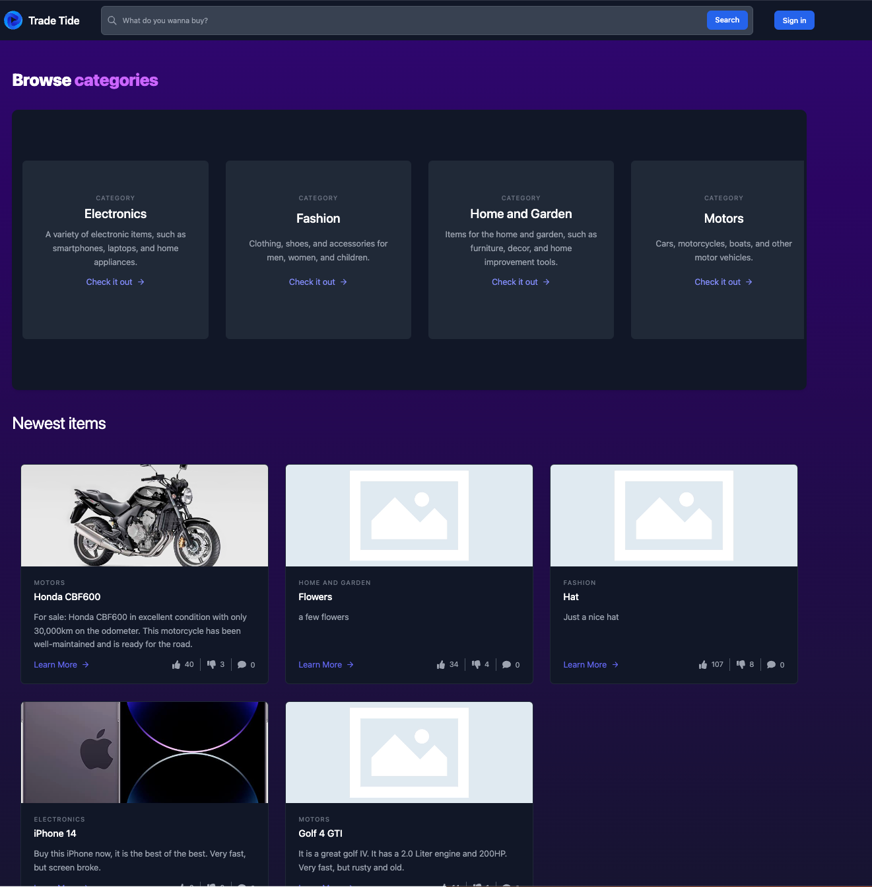
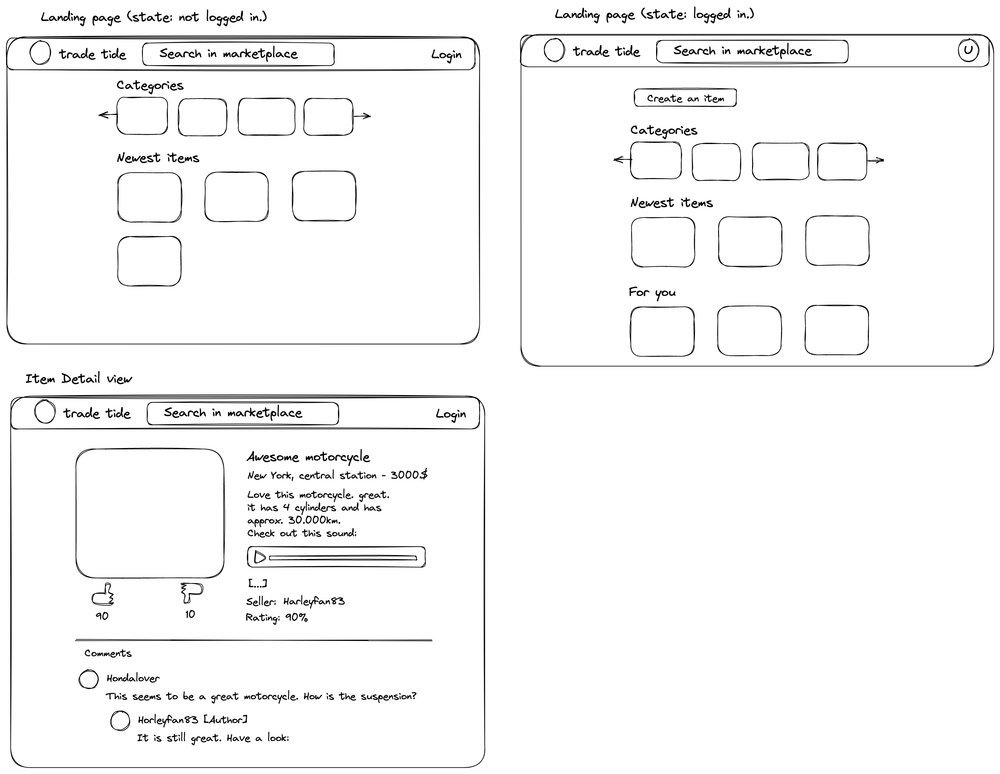

# Note
This is a [T3 Stack](https://create.t3.gg/) project bootstrapped with `create-t3-app`.

Screenshot:

## What's next? How do I make an app with this?

This is a simple flea market application using the T3 stack. The technologies used here are the following:
- [Next.js](https://nextjs.org)
- [NextAuth.js](https://next-auth.js.org)
- [Prisma](https://prisma.io)
- [Tailwind CSS](https://tailwindcss.com)
- [tRPC](https://trpc.io)

## Prototyping

I did a quick prototyping using [excalidraw](https://excalidraw.com/) how the app should be looking. These are the results:

The template will be implemented using tailwind and designed properly.

## Installing
Install the packages using the command `npm install`. After that, you should create the database schema using `npx prisma db push`. This creates an .sqlite-Database file you can work with. If you wish, you can install it to other Databases such as PostgreSQL.

## Starting the application
Start the application using `npm run dev`.